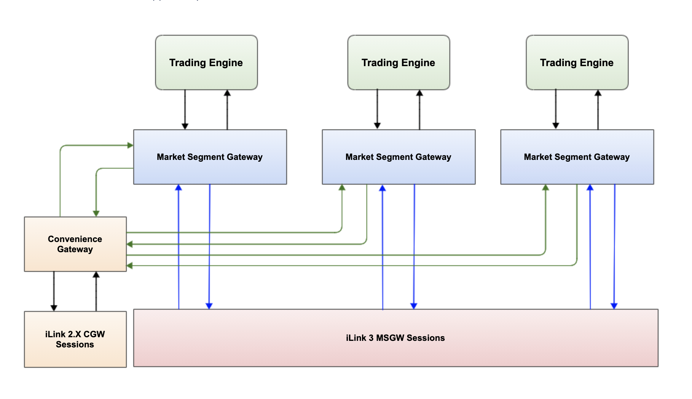

# iLink 3 Binary Order Entry

### Abstract

Main Changes:

* iLink2 
Tag value ASCII encoding
FIX Transport (FIXT)

* iLink3
Simple Binary Encoding
FIX Performance Session Layer (FIXP)

No Changes on TCP/IP

## Overview

iLink 3 introduces a new order entry protocol on CME Globex that provides the following:

- Simple Binary Encoding (SBE) - optimized for low latency of encoding and decoding
- FIX Performance (FIXP) protocol - supports simple session layer management; no session-level information (e.g. headers) required
- Optimized order entry on the CME Globex platform for futures, options, and BrokerTec markets
- Lean messages move administrative information out of order entry business message
- Standard message size, fixed positions, and fixed length fields 
- Consistent encoding method for market data and order entry
- XML schema and templates for order entry as with MDP 3

This diagram shows the final state of iLink order entry architecture following the complete migration to the iLink 3 messaging protocol in Q4 2020.

### Modules 

New Order (D)
Cancel-Replace (G)
Status Request (H)
Security Definition (c)
Mass Status Request (AF)
Quote Request (R)
New Order Cross (s)
Party Details Definition Request (CX)
Party Details List Request (CF)

#### Administrative Message Controls

The thresholds are in place for the following Administrative message types:

Negotiate
Establish
Terminate
Sequence
Retransmit Request

